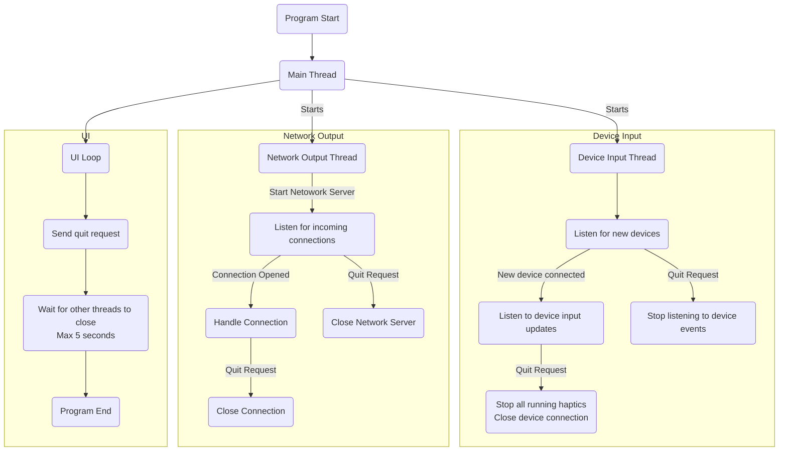

# Design Proposal
This is a basic proposal/outline of how I envision the system would work, not everything is accounted for yet and it is all heavily subject to change.

Interfaces:
- IDeviceState
  - ButtonCount
    - uint
  - ButtonStateAray
    - bool
  - AxisCount
    - uint
  - AxisStateAray
    - axisValue
    - axisMinValue
    - axisMaxValue

Threads:
- Main
  - UI
  - IO Mapping
- DeviceInput
  - Scan devices
  - Listen to connected devices
  - Output device state to shared memory
  - Manage haptics playing on device
  - Read shared memory for what haptics to play
- NetworkOutputs
  - Listen for incoming connections
  - Supply connection with UI configured data
  - Parse connection data to haptic targets