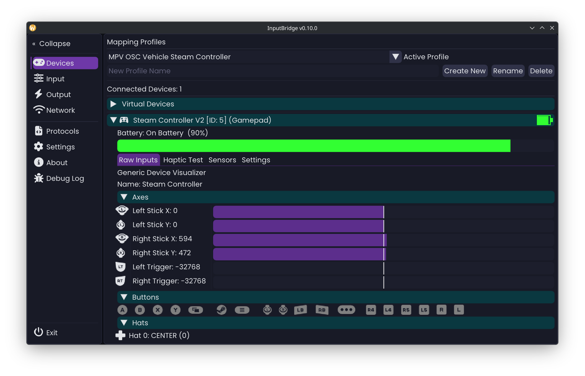

# InputBridge

[](https://github.com/marsmaantje/InputBridge/actions/workflows/build.yml)

InputBridge reads joystick, gamepad, steering wheel, and flight stick input and streams it over **OSC** and **WebSocket** to any receiving application. It also accepts haptic commands back — rumble, force feedback, adaptive triggers — and dispatches them to connected devices in real time.



---

## Supported Devices

| Device                      | Input Features                                                            | Haptic Features                                                                    |
| --------------------------- | ------------------------------------------------------------------------- | ---------------------------------------------------------------------------------- |
| Generic Gamepad             | Axes, buttons, gyro, accelerometer, touchpad                              | Rumble (low / high frequency)                                                      |
| Steam Controller (V1 & V2)  | Axes, buttons, dual touchpads, gyro, accelerometer, capacitive grip/stick | Touchpad haptics (raw HID), rumble                                                 |
| Nintendo Joy-Con (L/R pair) | Axes, buttons, independent per-side gyro & accelerometer                  | —                                                                                  |
| Sony DualSense (PS5)        | Axes, buttons, touchpad (2-finger), gyro, accelerometer                   | rumble, LED control — USB & Bluetooth                                              |
| Steering Wheel              | Axes, buttons                                                             | Constant force, periodic, condition effects (Spring / Damper / Inertia / Friction) |
| Flight Stick / Throttle     | Axes, buttons                                                             | Constant force, periodic, condition on both pitch and roll axes                    |

---

## Quick Start

1. **Download** the latest build for your platform from [Releases](../../releases).
2. **Connect** your controller — it appears in the **Devices** tab automatically with matching hardware icons and optional controller-specific input labels.
3. **Create a protocol** in the **Protocols** tab (or import a template from `protocols/templates/`).
4. **Configure inputs** in the **Input** tab — map analog, digital, sensor, analog-to-digital, and channel-mixed inputs to protocol fields.
5. **Start the server** in the **Network** tab and select your output protocol.

See the [Wiki](../../wiki) for a full step-by-step guide and reference documentation.

---

## Features

* **Analog-to-Digital Mapping** — Experimental mapping editor allows converting analog inputs into digital button outputs using configurable thresholds. Includes live threshold progress previews, protocol integration, OSC output support, field usage validation, and profile persistence.
* **Advanced Channel Mixing** — Experimental analog channel mixing system supporting full-range and half-range inputs, live output previews, protocol preview integration, and real-time value visualization.
* **Enhanced Deadzone Controls** — Deadzone limit expanded to `1.0` with dedicated deadzone indicator markers, improved analog value visualization, and separate dual-direction and single-direction value bars where appropriate.
* **Kenney Input Prompts Integration** — Integrated Kenney Input Prompts icon font (v1.5) provides controller-aware device, button, axis, and input icons throughout the UI. Includes configurable toggles for device icons and icon-based input labels.
* **Gyro, Accelerometer & Touchpad Mapping** — map gyroscope rates, accelerometer axes, and touchpad position/pressure directly to output protocol fields, just like regular axes. Split L/R sensors on Joy-Con and Steam Controller are each independently mappable.
* **Battery Level Output** — battery percentage and charging state are available as mappable analog sources for any connected device, including separate Left Joy-Con battery for split pairs.
* **Protocol Editor** — define exactly which fields to send, with custom OSC paths and WebSocket keys. Import, export, duplicate, and version-control protocol files.
* **Mapping Profiles** — multiple named profiles, each with independent analog mappings, digital mappings, analog-to-digital mappings, channel mixes, server settings, and protocol selections.
* **Virtual Devices** — create simulated joysticks to test protocols without real hardware.
* **Undo / Redo** — 50-step history for all protocol editing operations.
* **Backup Manager** — automatic timestamped backups before every destructive change.
* **Debug Log** — built-in SDL log viewer with level filtering and auto-scroll, accessible from the sidebar.
* **Themes** — VRChat, Resonite, Cyberpunk 2077, and custom JSON themes.

---

## Network

### OSC Server

Sends analog, digital, sensor, battery, analog-to-digital, and channel-mixed data over UDP. Defaults: send `127.0.0.1:9066`, receive `9068`.

Incoming haptic paths — both short and long forms are always active:

```text
/haptic/rumble          iiffi   deviceId, slot, low_freq, high_freq, duration_ms
/haptic/constant        iifi    deviceId, slot, strength, duration_ms
/haptic/periodic        iiififfii  deviceId, slot, wave_type, strength, period, magnitude, offset, phase, duration_ms
/haptic/condition       iiiffffffi deviceId, slot, condition_type, right_sat, left_sat, right_coeff, left_coeff, deadband, center, duration_ms
/haptic/gain            ii      deviceId, gain (0–100)
```

Subchannel paths encode the slot in the URL (`/haptic/rumble/0`, `/haptic/rumble/1`, …) for hosts like Resonite that allow only one message per path per frame.

DualSense adaptive triggers use `/inputbridge/haptics/dualsense/trigger/{left|right}/{feedback|weapon|vibration|off}`.

### WebSocket Server

Accepts JSON haptic commands on port `4269` (default):

```json
{ "device": 1, "type": "gamepad", "effect": "rumble",
  "params": { "large_magnitude": 0.8, "small_magnitude": 0.2, "duration_ms": 500 } }
```

Supported types: `gamepad` (rumble, dualsense_trigger), `steering_wheel` / `flight_stick` (constant, periodic, condition, gain), `wheel` (led_rpm).

---

## Protocol System

Protocols are JSON files in `protocols/definitions/` (on Linux, in the XDG config directory). Each one specifies a transport (`osc` / `websocket`), a direction (`output` / `input`), and a list of fields with their OSC paths or WebSocket keys.

```json
{
  "name": "Sim Racing OSC Output",
  "transport": "osc",
  "direction": "output",
  "osc": { "host": "127.0.0.1", "sendPort": 9066, "recvPort": 9068 },
  "fields": [
    { "fieldId": "axis_steering", "oscPath": "/input/steering", "enabled": true },
    { "fieldId": "axis_throttle", "oscPath": "/input/throttle", "enabled": true },
    { "fieldId": "axis_brake",    "oscPath": "/input/brake",    "enabled": true },
    { "fieldId": "sensor_gyro_x", "oscPath": "/sensor/gyro/x",  "enabled": true },
    { "fieldId": "trigger_pressed", "oscPath": "/input/trigger", "enabled": true }
  ]
}
```

Protocol fields support analog inputs, digital inputs, gyroscope data, accelerometer data, touchpad values, capacitive-touch sensors, battery status, analog-to-digital mappings, and channel-mixed outputs.

Protocol previews display the currently resolved output values, including analog-to-digital mappings and channel-mixed outputs, making it easier to validate configurations before transmitting data.

Custom fields can be added to `protocols/input_fields.json` and will appear in the Protocol Editor field picker. Reload at runtime via **Protocols → Reload Fields**.

---

## Building

**Requirements:** CMake 3.16+, C++20 compiler, Git (for submodules).

```bash
git clone --recursive https://github.com/marsmaantje/InputBridge.git
cd InputBridge
cmake -B build -DCMAKE_BUILD_TYPE=Release
cmake --build build
```

**CMake options:**

| Option                   | Default | Description         |
| ------------------------ | ------- | ------------------- |
| `ENABLE_EXCLUSIVE_INPUT` | ON      | Device-hide support |
| `ENABLE_WEBSOCKETS`      | ON      | WebSocket server    |
| `ENABLE_OSC`             | ON      | OSC server          |
| `BUILD_TESTS`            | OFF     | Google Test suite   |

Platform-specific dependency lists and packaging instructions are in the [Building from Source](../../wiki/Building-from-Source) wiki page.
