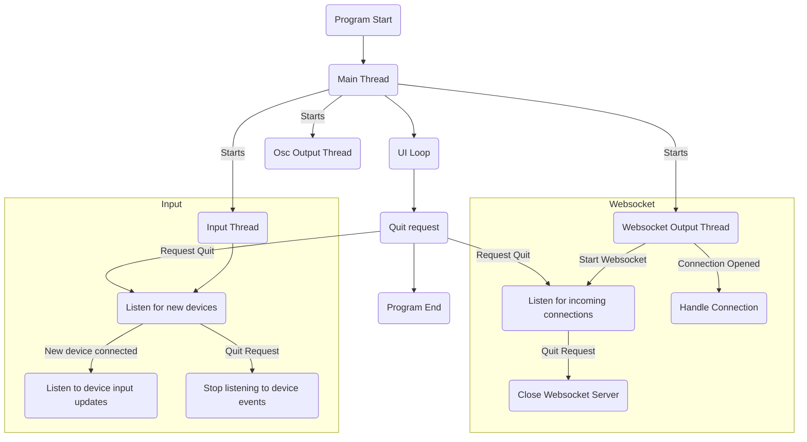

# InputBridge

```mermaid
graph TD;
idStart(Program Start)
idEnd(Program End)

idMain(Main Thread)
idUi(UI Loop)
idQuit(Quit request)

idInput(Input Thread)
idInputListen(Listen for new devices)
idInputConnectionStart(Listen to device input updates)
idInputListenQuit(Stop listening to device events)

idWebsocket(Websocket Output Thread)
idWebsocketListen(Listen for incoming connections)
idWebsocketConnection(Handle Connection)
idWebsocketQuit(Close Websocket Server)

idOsc(Osc Output Thread)


idStart-->idMain

idMain--Starts-->idInput & idWebsocket & idOsc

idMain-->idUi

idUi-->idQuit
idQuit-->idEnd

subgraph Input
idInput-->idInputListen
idInputListen--New device connected-->idInputConnectionStart
idInputListen--Quit Request-->idInputListenQuit
end

subgraph Websocket
idWebsocket--Start Websocket-->idWebsocketListen
idWebsocket--Connection Opened-->idWebsocketConnection
idWebsocketListen--Quit Request-->idWebsocketQuit
end

idQuit--Request Quit-->idInputListen & idWebsocketListen
```